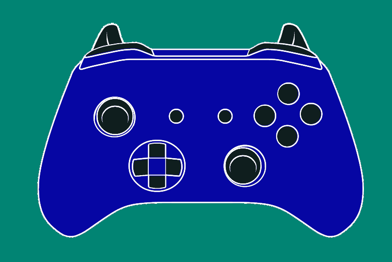
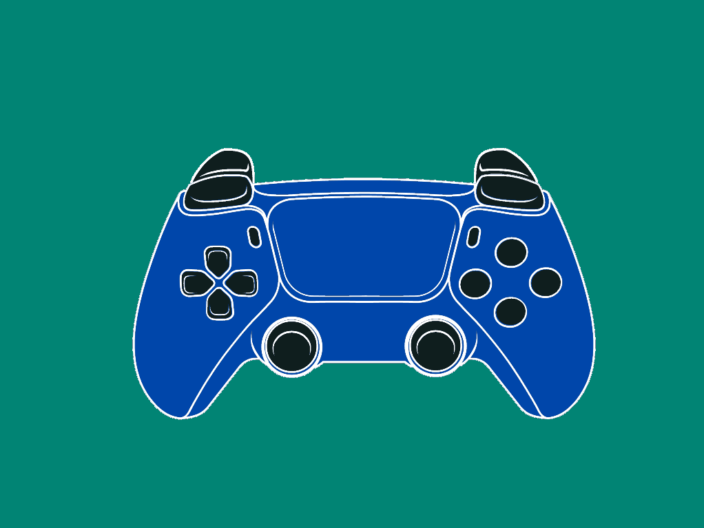
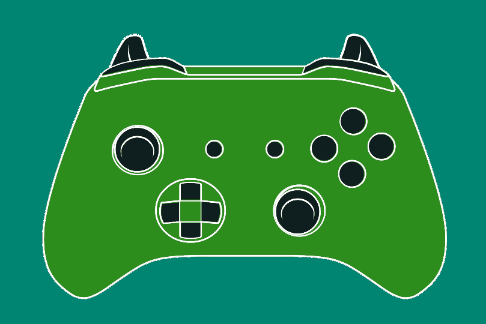
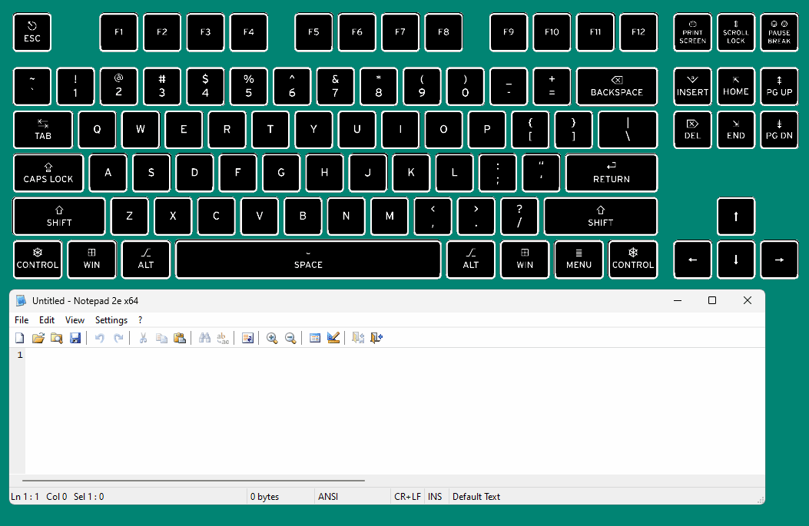

# Simple Stream Input Overlay

This is a very simple input overlaying program with controller support, intended to be used with OBS or
otherwise some video compositing software.

It offers intuitive and minimal hassle setup/usage, although at the cost of flexibility / customizability. It has controller presets
for the following controllers currently, which are automatically detected:
- Xbox Series
- Dualsense

It also offers keyboard presets for the following scale layouts:
- Alphanumeric
- Tenkeyless
- Fullsize

The keyboard input is scancode based, which doesn't really support other layouts.

The assets used to produced the overlay graphic are based off of https://thoseawesomeguys.com/prompts/

**Although it is capable of supporting whatever controllers SDL2 supports.** Any controller that does not have a preset will default to
using the Xbox controller assets.

*This program is only designed for Windows currently, even though it uses SDL2 due to the way the interaction is designed!*

## Media

Xbox Preset Layout.

Playstation Preset Layout.

Live controller switching support.

Keyboard Layout.

## Dependencies
- SDL2
  - SDL2_image
- Win32

## Building
The build script uses gcc, but it should be very easy to tune for whatever compiler you want. The only exception is that it
has to run on Windows since this is a Windows program.

## Installing

There should be some releases for the program in the releases section.

## License
Public Domain
